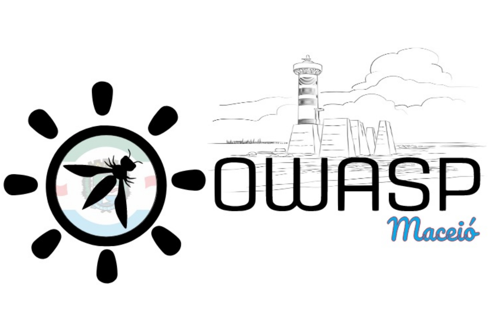

---

layout: col-sidebar
title: OWASP Maceio Chapter
tags: example-tag
region: South America
country: Brazil
meetup-group: owasp-maceio-chapter

---

## Welcome

Welcome to the OWASP [Maceió](https://pt.wikipedia.org/wiki/Macei%C3%B3) Chapter home page.

The OWASP Maceió chapter typically meets on the **last Friday every two months starting in January**. We host a great security-related speaker on an appsec topic. In October, we hold our annual dinner, a special moment to connect and celebrate. Join us for an excellent opportunity to learn, network before and after the talk, and enjoy the welcoming community in Maceió.

## Participation
The Open Worldwide Application Security Project (OWASP) is a nonprofit foundation that works to improve the security of software. All of our projects, tools, documents, forums, and chapters are free and open to anyone interested in improving application security. 

Chapters are led by local leaders in accordance with the [Chapters Policy](/www-policy/operational/chapters). Financial contributions should only be made online using the authorized online donation button. 

Everyone is welcome and encouraged to participate in our [Projects](/projects/), [Local Chapters](/chapters/), [Events](/events/), [Online Groups](https://groups.google.com/a/owasp.com/){:target='_blank'}, and [Community Slack Channel](https://owasp.slack.com/){:target='_blank'}. We especially encourage diversity in all our initiatives. OWASP is a fantastic place to learn about application security, to network, and even to build your reputation as an expert. We also encourage you to be [become a member](/membership/) or consider a [donation](/donate/) to support our ongoing work.

## Next Meeting/Event <!-- You should keep this section as it will populate your meetup events -->

We are on Meetup. For the list of latest events please join our community [www.meetup.com/owasp-maceio-chapther](https://www.meetup.com/owasp-maceio-chapter/)

---------------------


